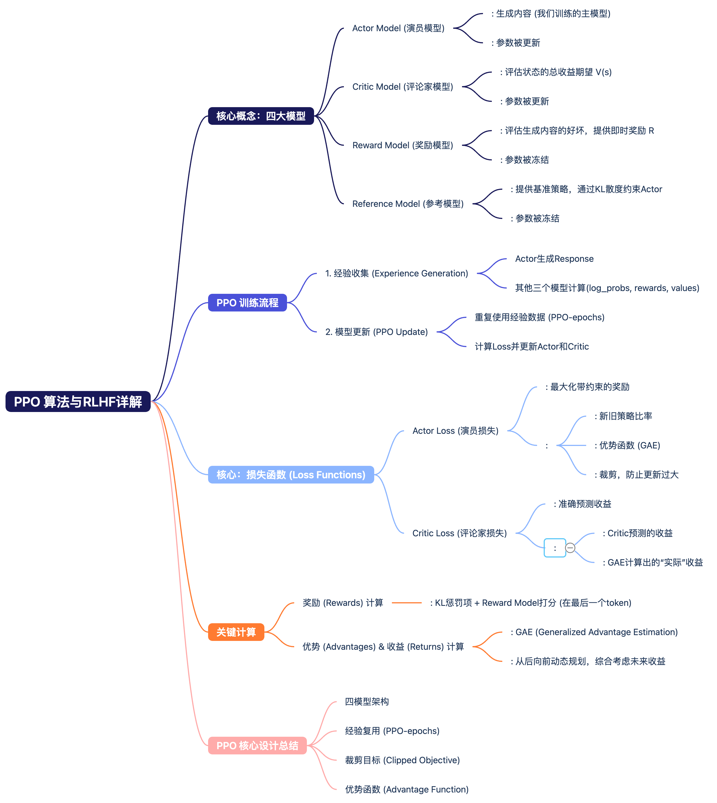

# PPO 算法详解：从大模型RLHF原理到代码实现

本教程旨在为读者提供一份清晰、易懂的PPO（Proximal Policy Optimization）算法指南，特别关注其在大型语言模型（LLM）的RLHF（Reinforcement Learning from Human Feedback）阶段的应用。

我们将结合**核心概念**、**数学公式**和**关键代码片段**，一步步拆解PPO的运作流程。本教程内容主要提炼自DeepSpeed-Chat项目的实现和优秀的社区解读文章。

## 1. 核心概念：RLHF中的四个关键模型

在RLHF的PPO阶段，我们并不是只用到一个模型，而是由四个模型协同工作，它们各司其职：


*(图片来源: (2 封私信 / 3 条消息) 图解大模型RLHF系列之：人人都能看懂的PPO原理与源码解读 - 知乎)*


*(图片来源: (2 封私信 / 3 条消息) 图解大模型RLHF系列之：人人都能看懂的PPO原理与源码解读 - 知乎)*


1.  **Actor Model (演员模型)**
    *   **作用**: 我们要训练的**主模型**。它根据输入的`prompt`生成`response`。
    *   **目标**: 生成更符合人类偏好的内容。
    *   **状态**: 训练过程中参数会**被更新**。

2.  **Critic Model (评论家模型)**
    *   **作用**: 评估Actor在某个状态下的**总收益期望** $V(s)$。它不产出文本，而是输出一个数值。
    *   **目标**: 准确地预测未来的总收益，帮助Actor判断当前动作的长期价值。
    *   **状态**: 训练过程中参数会**被更新**。

3.  **Reward Model (奖励模型)**
    *   **作用**: 评估Actor生成的`response`有多好，给出一个**即时奖励分数** $R(s, a)$。
    *   **目标**: 为Actor的每一步生成提供一个即时的、量化的反馈。
    *   **状态**: 训练过程中参数**被冻结**。

4.  **Reference Model (参考模型)**
    *   **作用**: 通常是SFT（Supervised Fine-Tuning）阶段的模型副本。它提供一个**基准策略**。
    *   **目标**: 通过计算KL散度，防止Actor模型在优化过程中“跑偏”，与原始模型差异过大。
    *   **状态**: 训练过程中参数**被冻结**。

## 2. PPO 训练流程概览

PPO的训练是一个循环往复的过程，可以分为两个主要阶段：

1.  **经验收集阶段 (Experience Generation)**
    *   **输入**: 一批 `prompts`。
    *   **过程**:
        1.  **Actor**模型根据`prompts`生成完整的`responses`。
        2.  对于生成过程中的每一个`token`（即每一个`action`），我们用其他三个模型计算出一系列用于后续训练的值：
            *   **Reward Model** 计算即时奖励 $R_t$。
            *   **Critic Model** 预测期望总收益 $V_t$。
            *   **Reference Model** 计算`log_probs`，用于后续计算KL散度。
    *   **输出**: 一批包含了 `(prompt, response, log_probs, rewards, values, ...)` 的经验数据。

2.  **模型更新阶段 (PPO Update)**
    *   **核心思想**: PPO的精髓在于，它会**重复使用**上一步收集到的经验数据，在一个`for`循环（PPO-epochs）中多次更新Actor和Critic模型，从而提高数据利用率和训练稳定性。
    *   **过程**: 在`ppo_epochs`循环中，计算`Actor Loss`和`Critic Loss`，并执行反向传播，更新模型参数。

## 3. 损失函数与代码详解

这是PPO最核心的部分。我们将详细拆解Actor和Critic的损失函数。

### 3.1 Actor Loss (演员损失)

Actor的目标是最大化奖励。PPO通过一个巧妙的“裁剪”目标函数来实现稳定更新。

#### **最终公式**

$\text{Actor Loss} = - \min \left( \text{ratio} \cdot \text{advantages}, \quad \text{clip}(\text{ratio}, 1-\epsilon, 1+\epsilon) \cdot \text{advantages} \right)$

这个公式看起来复杂，我们来逐一拆解它的组成部分：

*   **`ratio` (新旧策略比率)**
    *   **含义**: 衡量当前更新后的Actor策略与收集经验时的旧策略的差异。
    *   **公式**: $\text{ratio} = \frac{\pi_{\text{new}}(a_t|s_t)}{\pi_{\text{old}}(a_t|s_t)} = \exp(\log\pi_{\text{new}}(a_t|s_t) - \log\pi_{\text{old}}(a_t|s_t))$
    *   **作用**: 如果`ratio` > 1，说明新策略更倾向于采取这个动作。

*   **`advantages` (优势函数)**
    *   **含义**: 衡量在当前状态下，采取某个动作比平均水平好多少。它告诉我们这个动作是“惊喜”还是“失望”。
    *   **公式 (GAE)**: $\text{Adv}_t = (R_t + \gamma V_{t+1} - V_t) + (\gamma \lambda) \cdot \text{Adv}_{t+1}$
    *   **作用**: 如果`advantages` > 0，说明这个动作带来的回报高于预期，我们应该增大采取它的概率。

*   **`clip` (裁剪函数)**
    *   **含义**: 将`ratio`限制在一个 `[1-ε, 1+ε]` 的小区间内（通常ε=0.2）。
    *   **作用**: 这是PPO的核心！它防止`ratio`变得过大或过小，从而避免Actor策略更新步子太大导致训练崩溃。如果更新幅度超出了这个范围，loss会被“裁剪”，梯度更新会受到限制。

#### **代码实现**

下面是计算Actor Loss的关键代码，与上述公式完全对应。

```python
def actor_loss_fn(self, logprobs, old_logprobs, advantages, mask):
    """
    logprobs: 新Actor实时计算的log_probs
    old_logprobs：收集经验时的旧Actor的log_probs (固定)
    advantages：优势函数计算结果 (固定)
    mask：用于忽略padding部分
    """
    # 对应公式中的 ratio = exp(log_new - log_old)
    log_ratio = (logprobs - old_logprobs) * mask
    ratio = torch.exp(log_ratio)

    # 对应公式中的 advantages * ratio
    pg_loss1 = -advantages * ratio
    # 对应公式中的 advantages * clip(ratio, ...)
    pg_loss2 = -advantages * torch.clamp(ratio, 1.0 - self.cliprange, 1.0 + self.cliprange)

    # 对应公式中的 min(...)，并取平均
    pg_loss = torch.sum(torch.max(pg_loss1, pg_loss2) * mask) / mask.sum()
    return pg_loss
```

### 3.2 Critic Loss (评论家损失)

Critic的目标是更准确地预测总收益`V`。它的损失函数相对简单，是一个均方误差（MSE）。

#### **最终公式**

$\text{Critic Loss} = \frac{1}{2} (\text{values} - \text{returns})^2$

*   **`values` (预测收益)**
    *   **含义**: 当前Critic模型对各个状态的期望总收益的**预测值**。

*   **`returns` (实际收益)**
    *   **含义**: 我们通过经验数据计算出的更接近“真实”的收益值。
    *   **公式**: $ \text{returns}_t = \text{advantages}_t + \text{old\_values}_t $
    *   **来源**: 这个值是在计算优势函数时一并得出的。

#### **代码实现**

```python
def critic_loss_fn(self, values, old_values, returns, mask):
    """
    values: 新Critic实时计算的value
    old_values: 收集经验时的旧Critic的value (固定)
    returns: 实际收益 (固定)
    """
    # 同样引入了clip机制，防止value更新过快
    values_clipped = torch.clamp(
        values,
        old_values - self.cliprange_value,
        old_values + self.cliprange_value,
    )
    
    # (预测收益 - 实际收益)^2
    vf_loss1 = (values - returns)**2
    vf_loss2 = (values_clipped - returns)**2
    
    # 取两者中较大的loss，并求平均
    vf_loss = 0.5 * torch.sum(
        torch.max(vf_loss1, vf_loss2) * mask) / mask.sum()
    return vf_loss
```

### 3.3 奖励和优势的计算

你可能已经发现，`Actor Loss`和`Critic Loss`都依赖于`advantages`和`returns`，而`advantages`又依赖于`rewards`。下面是计算这两个核心指标的代码。

#### **计算Rewards**

在`deepspeed-chat`的实现中，`reward`并非直接来自Reward Model，而是由两部分组成：

1.  **KL惩罚项**: `ref_log_probs - log_probs`，用于约束Actor不要偏离Reference Model太远。
2.  **Reward Model打分**: 只有在`response`的**最后一个token**位置，才会加上Reward Model给出的分数。

```python
def compute_rewards(self, prompts, log_probs, ref_log_probs, reward_score, action_mask):
    # 1. 计算KL惩罚项
    kl_divergence_estimate = -self.kl_ctl * (log_probs - ref_log_probs)
    rewards = kl_divergence_estimate
    
    # 2. 在response的最后一个token位置加上reward_score
    start = prompts.shape[1] - 1
    ends = start + action_mask[:, start:].sum(1) + 1
    reward_clip = torch.clamp(reward_score, -self.clip_reward_value, self.clip_reward_value)
    
    batch_size = log_probs.shape[0]
    for j in range(batch_size):
        rewards[j, start:ends[j]][-1] += reward_clip[j]

    return rewards
```

#### **计算Advantages和Returns (使用GAE)**

这个函数通过一次**从后向前**的动态规划，同时计算出所有时间步的`advantages`和`returns`。

```python
def get_advantages_and_returns(self, values, rewards, start):
    lastgaelam = 0
    advantages_reversed = []
    length = rewards.size()[-1]
    
    # 从response的最后一个token向前遍历
    for t in reversed(range(start, length)):
        nextvalues = values[:, t + 1] if t < length - 1 else 0.0
        # delta = R_t + gamma * V_{t+1} - V_t
        delta = rewards[:, t] + self.gamma * nextvalues - values[:, t]
        # Adv_t = delta + gamma * lambda * Adv_{t+1}
        lastgaelam = delta + self.gamma * self.lam * lastgaelam
        advantages_reversed.append(lastgaelam)
        
    advantages = torch.stack(advantages_reversed[::-1], dim=1)
    # returns = advantages + values
    returns = advantages + values[:, start:]
    
    return advantages.detach(), returns
```

## 4. 总结

PPO算法通过以下几个关键设计，实现了在RLHF中高效且稳定地训练语言模型：

*   **四模型架构**: 分工明确，Actor和Critic负责学习和决策，Reward和Reference负责评估和约束。
*   **经验复用**: 通过PPO-epochs机制，重复利用昂贵的经验数据，提升了训练效率。
*   **Clipped Objective (裁剪目标)**: 核心创新，通过限制新旧策略的比率，保证了更新的稳定性，有效避免了训练崩溃。
*   **优势函数 (Advantage)**: 相比直接使用奖励，优势函数提供了更优质的梯度信号，指明了动作的“好坏程度”。
